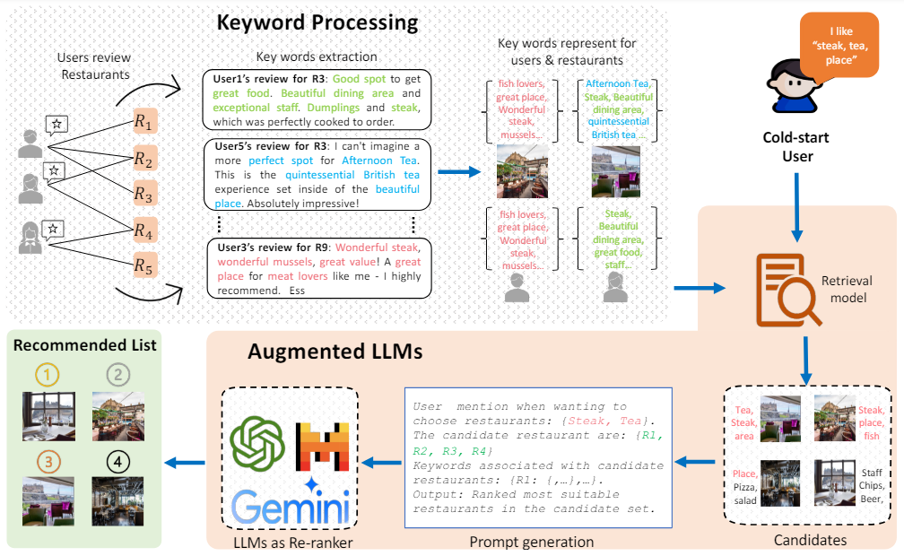

# KALM4Rec
## Keyword-driven Retrieval-Augmented Large Language Models for Cold-start User Recommendations 
<p align="center">

</p>

## Dependencies
```
spacy, DGL, 
```
##  Usage

### Stage 1: Keyword extraction and Processing
```
# extract keyword
python .\extractor.py --edgeType IUF --city singapore --kwExtractor kw_NLTK

# Download train: train is filtered file at ./data/preprocessed/by_city-users_min_3_reviews/keywords_spacy-min_3/train) then rename as: {city}-keyword_train.json
# Download test: train is filtered file at ./data/preprocessed/by_city-users_min_3_reviews/keywords_spacy/test) then rename as: {city}-keyword_test.json
# move those train/test keywords file to ./data/keywords directory

# Download irf and tf_irf;  rename as {city}-keyword-IRF.json {city}-keyword-TFIRF.json ; move to  ./data/score/{city}-keyword-TFIRF.json
# Download iuf and tf_iuf;  rename as {city}-keyword-IUF.json {city}-keyword-TFIUF.json ; move to  ./data/score/{city}-keyword-TFIUF.json
# remember to delete all files 
```

### Stage 2: Generate candidates: jaccard, MPG, MF, MVAE.

```
# jaccard
python cmain.py --RetModel jaccard

# MF
python .\retrieval.py --RetModel MF  --export2LLMs --city edinburgh --num_epochs 100 --hidden_dim 256 --lr 0.007

# MVAE
python .\retrieval.py --RetModel MVAE  --export2LLMs --city edinburgh --num_epochs 500 --hidden_dim 128 --lr 0.003

# MPG
python retrieval.py --RetModel MGP --export2LLMs --city singapore --edgeType IUF


```
#### Args

> `checkKeyword`: check number of keywords then exit
>
> `RetModel`: models.
>
> `genType`: build a KNN model to obtain most similar keyword in case of missing for testing user.
>
>

#### Results for retrieval models:
| Models      | P@20        | R@20          |
| :----:      |    :----:   |    :----:     |
| jaccard     | 0.03        |   0.06        |
| MF          | 0.05        |   0.13        |
| MVAE        | 0.08        |   0.28        |
| MPG         | 0.15        |   0.42        |

### Stage 3: Recommend by LLMs

## Dataset:
```
Yelp, Tripadvisor
Link: https://www.cs.cmu.edu/~jiweil/html/hotel-review.html
```
